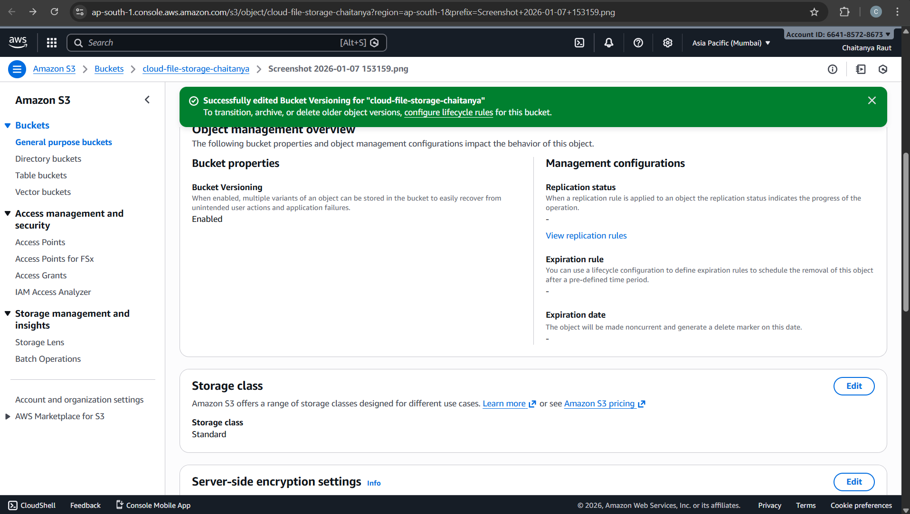
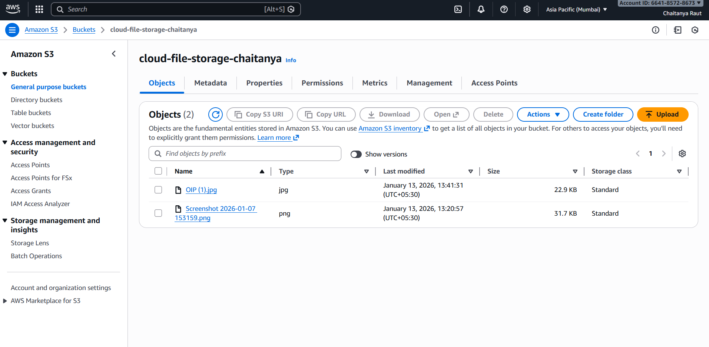
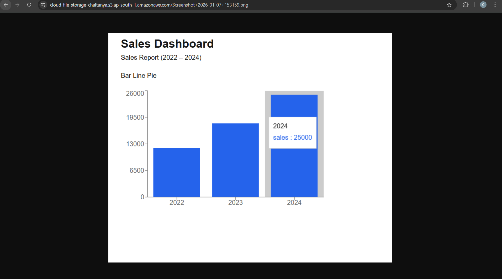

# Cloud-Based File Storage System

## Objective
Build a secure cloud file storage system using AWS S3.

## Services Used
- AWS S3
- IAM
- HTML

## Features
- File upload
- File download
- File versioning
- Public sharing via URL

## Architecture
User → Web Interface → AWS S3 Bucket

## Screenshots

### HTML File Upload Page

### S3 Versioning Enabled

### File Uploaded to S3

### File Access via Object URL

## Conclusion
This project successfully demonstrates a basic cloud-based file storage system using AWS S3.  
It fulfills the internship requirement by showcasing cloud usage, file storage, versioning, and public access.
